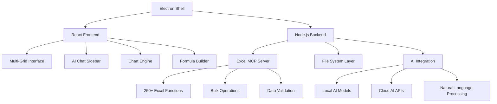

# 🚀 **EXCEL AI DEMOCRATIZATION PLATFORM**
## The Next-Generation Data Analysis Revolution

---

## 📋 **EXECUTIVE SUMMARY**

### 🎯 **Vision Statement**
**"Democratize advanced data analysis by making AI-powered Excel accessible to every business user, regardless of technical expertise."**

We are building the world's first **AI-native Excel platform** that combines:
- **250+ Excel functions** with **AI chat interface**
- **Enterprise-grade performance** with **consumer simplicity**
- **Local data security** with **cloud AI intelligence**
- **Professional analytics** with **natural language queries**

### 💰 **Market Opportunity**
- **$50B+ spreadsheet market** (Microsoft Office dominance)
- **$200B+ business intelligence market** (fragmented, complex tools)
- **500M+ Excel users globally** (underserved by current AI tools)
- **$100K+ annual cost** per data analyst (automation opportunity)

### 🏆 **Competitive Advantage**
1. **AI-First Design** - Built for natural language from day one
2. **Local Processing** - Enterprise security without cloud dependency
3. **Familiar Interface** - Excel-like UX with AI superpowers
4. **250+ Functions** - Most comprehensive Excel engine available
5. **Real-time Collaboration** - Multi-user analysis workflows

---

## 🌟 **THE BIG PICTURE: DEMOCRATIZING DATA ANALYSIS**

### 🔄 **From This (Current State)**
```
❌ Complex Tools:
- Tableau: $75/user/month, steep learning curve
- Power BI: Microsoft lock-in, limited AI
- Python/R: Requires coding skills
- Excel: Limited AI, poor multi-file handling

❌ Barriers:
- Technical expertise required
- Expensive enterprise licenses
- Cloud security concerns
- Fragmented tool ecosystem
```

### ✅ **To This (Our Vision)**
```
✅ Unified Platform:
- Natural language: "Show me top 10 customers by revenue"
- AI-powered insights: Automatic pattern detection
- Drag-drop simplicity: No training required
- Enterprise security: Local processing, encrypted data

✅ Democratization:
- Business users become data analysts
- Instant insights without coding
- Real-time collaboration
- Professional-grade results
```

---

## 🏗️ **TECHNICAL ARCHITECTURE**

### 🖥️ **Core Platform: Electron Desktop App**



### 🧠 **AI Integration Layers**

**1. Natural Language Interface**
```typescript
interface AIQuery {
  input: string;           // "Find customers with > $100K revenue"
  context: DataContext;    // Current spreadsheet data
  output: {
    formula?: string;      // "=FILTER(A:B, B:B>100000)"
    visualization?: Chart; // Auto-generated chart
    insights?: string[];   // AI-discovered patterns
    actions?: Action[];    // Suggested next steps
  };
}
```

**2. Smart Formula Generation**
```typescript
const aiFormulas = {
  // Natural language to Excel formulas
  "sum all sales": "=SUM(Sales!A:A)",
  "average by region": "=AVERAGEIF(Region!A:A, 'North', Sales!B:B)",
  "find duplicates": "=COUNTIF(A:A, A1)>1",
  "growth rate": "=(B2-A2)/A2*100",

  // Advanced AI-generated formulas
  "customer lifetime value": "=NPV(0.1, C2:G2)",
  "seasonal adjustment": "=TREND(A2:A13, ROW(A2:A13))",
  "outlier detection": "=ABS(A2-AVERAGE($A:$A))>2*STDEV($A:$A)"
};
```

**3. Automated Insights Engine**
```typescript
interface InsightEngine {
  // Pattern recognition
  detectTrends(): TrendAnalysis[];
  findOutliers(): OutlierReport[];
  identifyCorrelations(): CorrelationMatrix;

  // Predictive analytics
  forecastTrends(): ForecastModel[];
  riskAssessment(): RiskReport;

  // Business intelligence
  suggestKPIs(): KPIRecommendation[];
  identifyOpportunities(): BusinessInsight[];
}
```

---

## 🎯 **PRODUCT CAPABILITIES**

### 💪 **Core Features**

**1. AI-Powered Data Analysis**
- **Natural Language Queries**: "Show me Q4 sales trends"
- **Smart Suggestions**: AI recommends analysis based on data
- **Automatic Insights**: Pattern detection without prompting
- **Formula Translation**: Plain English → Excel formulas
- **Data Storytelling**: AI generates narrative insights

**2. Advanced Excel Engine**
- **250+ Functions**: Complete Excel compatibility + modern functions
- **Multi-file Operations**: Process dozens of files simultaneously
- **Real-time Calculation**: Instant results on formula changes
- **Array Formulas**: Dynamic arrays, FILTER, SORT, UNIQUE
- **Custom Functions**: Build your own business-specific functions

**3. Professional Data Grid**
- **Multi-grid Interface**: 10+ grids simultaneously
- **Infinite Scrolling**: Handle millions of rows
- **Real-time Updates**: Live data feeds
- **Advanced Filtering**: Visual filter builder
- **Export Options**: Excel, PDF, CSV, PowerPoint

**4. Visualization Engine**
- **Auto-charting**: AI selects best chart type
- **Interactive Dashboards**: Drill-down capabilities
- **Real-time Charts**: Live updating visualizations
- **Professional Templates**: Business-ready designs
- **Multi-chart Views**: Compare multiple metrics

### 🚀 **Advanced Capabilities**

**5. Collaboration Features**
- **Real-time Co-editing**: Multiple users, same file
- **Comment System**: Threaded discussions on cells
- **Version Control**: Track changes, revert to previous versions
- **Sharing Options**: Secure link sharing, permission controls
- **Team Workspaces**: Shared folders, templates

**6. Enterprise Integration**
- **SSO Support**: Active Directory, SAML, OAuth
- **API Connectivity**: REST APIs, databases, cloud services
- **Scheduled Reports**: Automated report generation
- **Audit Logging**: Compliance-ready activity tracking
- **Data Governance**: PII detection, access controls

**7. AI-Powered Automation**
- **Smart Templates**: AI creates analysis templates
- **Automated Reports**: Schedule recurring analyses
- **Data Quality Checks**: Automatic validation and cleanup
- **Trend Alerts**: Notifications on significant changes
- **Performance Optimization**: AI suggests formula improvements

---

## 🎪 **TARGET MARKETS & USE CASES**

### 🏢 **Primary Markets**

**1. Financial Services ($2B+ addressable market)**
- **Investment Banks**: Portfolio analysis, risk management, regulatory reporting
- **Hedge Funds**: Performance attribution, backtesting, investor reporting
- **Insurance**: Actuarial analysis, claims processing, regulatory compliance
- **Banking**: Credit risk analysis, loan portfolio management, stress testing

**Use Case Example - Hedge Fund:**
```
Daily Workflow:
1. Upload overnight trading data (CSV files)
2. Ask AI: "Calculate portfolio performance vs benchmark"
3. Generate investor reports automatically
4. Risk analysis: "Show me positions with >5% portfolio weight"
5. Export to PowerPoint for investor calls

Time Savings: 8 hours → 30 minutes
Cost Savings: $200K/year per analyst
```

**2. Consulting & Professional Services ($1.5B+ addressable market)**
- **Management Consulting**: Client analysis, market sizing, competitive benchmarking
- **Accounting Firms**: Financial audits, tax preparation, client reporting
- **Law Firms**: Discovery analysis, case cost tracking, billing optimization
- **Real Estate**: Property valuation, market analysis, investment modeling

**3. Corporate Analytics Teams ($3B+ addressable market)**
- **Sales Analytics**: Territory planning, quota setting, commission calculations
- **Marketing Analytics**: Campaign ROI, customer segmentation, attribution modeling
- **Operations**: Supply chain optimization, capacity planning, cost analysis
- **HR Analytics**: Workforce planning, compensation analysis, performance tracking

### 🌟 **Vertical-Specific Solutions**

**Healthcare Analytics**
- **Claims Analysis**: Fraud detection, cost optimization
- **Clinical Trials**: Statistical analysis, regulatory reporting
- **Hospital Operations**: Capacity planning, staffing optimization
- **Pharmaceutical**: Drug development analytics, market access

**Manufacturing Intelligence**
- **Quality Control**: SPC charts, defect analysis
- **Supply Chain**: Supplier performance, inventory optimization
- **Production Planning**: Capacity utilization, scheduling
- **Maintenance**: Predictive analytics, downtime analysis

**Retail & E-commerce**
- **Inventory Management**: Demand forecasting, stock optimization
- **Customer Analytics**: Segmentation, lifetime value, churn prediction
- **Pricing Optimization**: Competitive analysis, margin optimization
- **Merchandising**: Category performance, seasonal trends

---

## 💻 **TECHNOLOGY STACK**

### 🏗️ **Frontend Architecture**

**Electron Desktop App**
```typescript
// Core Technologies
Electron 28+         // Desktop shell
React 18            // UI framework
TypeScript          // Type safety
Tailwind CSS        // Styling
Zustand             // State management

// Data Grid
AG-Grid Enterprise  // Professional data grid
React-Window        // Virtualization
Intersection Observer // Performance optimization

// Visualization
Chart.js            // Charting library
D3.js              // Custom visualizations
React-Chartjs-2    // React integration
Plotly.js          // Scientific charts

// AI Integration
OpenAI SDK         // GPT integration
Anthropic SDK      // Claude integration
Local Models       // Offline AI capabilities
```

### ⚙️ **Backend Services**

**Excel MCP Server (Node.js)**
```typescript
// Core Engine
Node.js 20+        // Runtime
TypeScript         // Type safety
Express.js         // API framework
SQLite             // Local database

// Excel Processing
xlsx.js            // Excel file parsing
PapaParse          // CSV processing
Formula.js         // Excel formula engine
Decimal.js         // Precise calculations

// AI Services
LangChain          // AI orchestration
Transformers.js    // Local NLP
Vector Search      // Semantic search
Embeddings         // Text similarity
```

### 🔌 **Integration Layer**

**External Connections**
```typescript
// Data Sources
REST APIs          // Web services
GraphQL           // Efficient queries
WebSockets        // Real-time data
ODBC/JDBC         // Database connections
File Watchers     // Automatic updates

// Cloud Storage
AWS S3            // Object storage
Google Drive      // Consumer files
OneDrive          // Enterprise files
Dropbox           // Team collaboration

// Business Systems
Salesforce API    // CRM integration
SAP HANA          // ERP systems
Snowflake         // Data warehouse
Power BI          // BI tools
```

---

## 📅 **DEVELOPMENT ROADMAP**

### 🎯 **Phase 1: MVP Foundation (Months 1-4)**

**Core Platform Development**
```
✅ Week 1-2:   Project setup, architecture design
✅ Week 3-6:   Electron shell, basic React UI
✅ Week 7-10:  Excel MCP integration
✅ Week 11-14: Basic AI chat interface
✅ Week 15-16: Alpha testing, bug fixes
```

**Key Features:**
- File upload/processing (Excel, CSV)
- Basic data grid with 50+ Excel functions
- Simple AI queries ("sum column A")
- Export to Excel/PDF
- Local data processing

**Success Metrics:**
- Process 100K row files in <5 seconds
- Support 50+ Excel functions
- Basic AI responses in <2 seconds
- 5 beta users providing feedback

### 🚀 **Phase 2: AI Integration (Months 5-8)**

**Advanced AI Capabilities**
```
✅ Month 5:    Natural language processing engine
✅ Month 6:    Smart formula generation
✅ Month 7:    Automated insights engine
✅ Month 8:    Advanced visualization AI
```

**Key Features:**
- Complex natural language queries
- AI-generated formulas and insights
- Auto-charting with smart recommendations
- Pattern detection and anomaly identification
- 150+ Excel functions

**Success Metrics:**
- 80% query accuracy for natural language
- Generate correct formulas 90% of the time
- Process complex queries in <5 seconds
- 50 beta users, 80% satisfaction

### 🏢 **Phase 3: Enterprise Features (Months 9-12)**

**Professional Grade Platform**
```
✅ Month 9:    Multi-grid interface
✅ Month 10:   Real-time collaboration
✅ Month 11:   Enterprise security & SSO
✅ Month 12:   Advanced analytics & reporting
```

**Key Features:**
- Multi-grid workstation interface
- Real-time collaboration and sharing
- SSO integration (Active Directory, SAML)
- Advanced analytics (statistical analysis, forecasting)
- All 250+ Excel functions
- API integrations

**Success Metrics:**
- Support 10+ simultaneous grids
- Real-time collaboration with 5+ users
- Enterprise security compliance
- 200 pilot customers

### 🌟 **Phase 4: Market Expansion (Months 13-18)**

**Industry-Specific Solutions**
```
✅ Month 13-14: Financial services package
✅ Month 15-16: Healthcare analytics suite
✅ Month 17-18: Manufacturing intelligence
```

**Key Features:**
- Vertical-specific templates and functions
- Industry compliance (SOX, HIPAA, etc.)
- Advanced forecasting and modeling
- Custom function builder
- Mobile companion app

### 🚀 **Phase 5: AI Revolution (Months 19-24)**

**Next-Generation AI Features**
```
✅ Month 19-20: GPT-4 integration, advanced reasoning
✅ Month 21-22: Autonomous data analysis
✅ Month 23-24: Predictive analytics platform
```

**Key Features:**
- Autonomous AI analyst that builds complete reports
- Predictive modeling without user input
- Natural language to complete dashboard
- AI-powered data governance
- Voice interface

---

## 💰 **BUSINESS MODEL & PRICING**

### 🎯 **Pricing Strategy**

**Freemium Model**
```
🆓 FREE (0-10 files/month)
- Basic Excel functions (100+)
- Simple AI queries
- Single user
- Community support

💼 PROFESSIONAL ($29/month)
- All Excel functions (250+)
- Advanced AI features
- Multi-file operations
- Email support
- Export to all formats

🏢 ENTERPRISE ($99/user/month)
- Everything in Professional
- Real-time collaboration
- SSO integration
- API access
- Priority support
- Custom functions

🏛️ ENTERPRISE PLUS ($299/user/month)
- Everything in Enterprise
- On-premise deployment
- Custom integrations
- Dedicated support
- Training & onboarding
- White-label options
```

### 📊 **Revenue Projections**

**Year 1: Foundation Building**
```
Q1: 100 users    × $29 = $2,900/month    = $35K ARR
Q2: 500 users    × $29 = $14,500/month   = $174K ARR
Q3: 1,500 users  × $29 = $43,500/month   = $522K ARR
Q4: 3,000 users  × $29 = $87,000/month   = $1.04M ARR

+ 10 Enterprise clients × $99 × 10 users = $9,900/month = $119K ARR

Total Year 1 ARR: $1.16M
```

**Year 2: Market Penetration**
```
Professional: 15,000 users × $29 = $435,000/month = $5.22M ARR
Enterprise: 100 companies × $99 × 20 users = $198,000/month = $2.38M ARR
Enterprise Plus: 20 companies × $299 × 50 users = $298,000/month = $3.58M ARR

Total Year 2 ARR: $11.18M
```

**Year 3: Scale & Expansion**
```
Professional: 50,000 users × $29 = $1.45M/month = $17.4M ARR
Enterprise: 500 companies × $99 × 25 users = $1.24M/month = $14.85M ARR
Enterprise Plus: 100 companies × $299 × 75 users = $2.24M/month = $26.9M ARR

Total Year 3 ARR: $59.15M
```

### 💡 **Additional Revenue Streams**

**1. Marketplace & Extensions**
- **Custom Functions**: $5-50 per function
- **Industry Templates**: $100-1000 per template
- **Data Connectors**: $20-100/month per connector
- **Training Courses**: $500-5000 per course

**2. Professional Services**
- **Implementation**: $10K-100K per enterprise
- **Custom Development**: $150-300/hour
- **Training & Support**: $5K-50K per engagement
- **Data Migration**: $20K-200K per project

**3. Data & Analytics**
- **Benchmarking Data**: Anonymous usage insights
- **Industry Reports**: Aggregated analytics
- **API Monetization**: Usage-based pricing
- **White-label Licensing**: $1M+ per major partner

---

## 🎯 **GO-TO-MARKET STRATEGY**

### 🚀 **Launch Strategy**

**Phase 1: Developer & Power User Community**
```
Target: 1,000 early adopters in first 3 months

Channels:
- GitHub: Open-source Excel MCP server
- Reddit: r/Excel, r/MachineLearning, r/Entrepreneur
- Hacker News: Technical launch story
- YouTube: Demo videos, tutorials
- LinkedIn: B2B professional content

Content:
- "How AI is revolutionizing Excel"
- "Build your own Excel AI assistant"
- "Replace expensive BI tools with AI Excel"
- Technical blog posts and tutorials
```

**Phase 2: Business User Acquisition**
```
Target: 10,000 professional users in months 4-12

Channels:
- Google Ads: "Excel AI", "Business Intelligence"
- LinkedIn Ads: Finance, consulting, analytics professionals
- Content Marketing: Business-focused tutorials
- Webinars: "AI-powered data analysis"
- Partnerships: Consulting firms, training companies

Content:
- Industry-specific use cases
- ROI calculators and case studies
- Professional video testimonials
- Certification programs
```

**Phase 3: Enterprise Sales**
```
Target: 100 enterprise clients in year 2

Channels:
- Direct sales team (5 reps)
- Partner channel program
- Industry conferences and events
- Account-based marketing
- Referral program

Sales Process:
- Demo → Pilot → Procurement → Implementation
- 30-day free trial for teams
- POC support and customization
- Executive briefings and ROI analysis
```

### 📈 **Customer Acquisition Tactics**

**1. Content-Driven Growth**
```
Blog Strategy:
- "10 Ways AI is Transforming Financial Analysis"
- "Excel vs Tableau: Why AI Changes Everything"
- "How [Company] Saved $500K with AI Excel"
- Technical tutorials and best practices

SEO Targets:
- "Excel AI integration" (1,000 searches/month)
- "Business intelligence alternative" (5,000 searches/month)
- "Data analysis software" (10,000 searches/month)
- "Excel formula generator" (2,000 searches/month)
```

**2. Community Building**
```
Excel AI Community:
- Discord server for power users
- Monthly virtual meetups
- User-generated content contests
- Beta tester program
- Advisory board participation

Partnerships:
- Excel MVP program collaboration
- University research partnerships
- Industry association sponsorships
- Consulting firm alliances
```

**3. Viral Features**
```
Built-in Growth:
- "Powered by Excel AI" watermark on exports
- Easy sharing of interactive dashboards
- Referral rewards program
- Public gallery of amazing analyses
- Social media integration for insights
```

---

## ⚔️ **COMPETITIVE ANALYSIS**

### 🏆 **Competitive Positioning**

**vs. Microsoft Excel**
```
✅ Our Advantages:
- Native AI integration (Excel has limited AI)
- Multi-file operations (Excel struggles)
- Modern interface (Excel feels dated)
- Natural language queries (Excel doesn't have)
- Real-time collaboration (Excel's is basic)

❌ Excel's Advantages:
- Massive installed base (500M+ users)
- Enterprise integration (Office 365)
- Brand recognition (40+ years)
- Ecosystem of add-ins
- Offline reliability

Strategy: Position as "Excel for the AI Era"
```

**vs. Tableau/Power BI**
```
✅ Our Advantages:
- Familiar Excel interface (no learning curve)
- Natural language queries (theirs are limited)
- Local data processing (no cloud dependency)
- Formula-based approach (analysts prefer)
- Lower cost ($29 vs $75+ per user)

❌ Their Advantages:
- Enterprise sales teams
- Advanced visualization options
- Data warehouse integrations
- Established BI market presence

Strategy: "Business Intelligence for Excel Users"
```

**vs. Google Sheets + AI Add-ons**
```
✅ Our Advantages:
- Desktop performance (vs browser limitations)
- Enterprise security (local processing)
- Advanced Excel functions (Google has fewer)
- Professional interface (more features)
- Offline capabilities

❌ Google's Advantages:
- Free tier (with Google account)
- Web-based accessibility
- Real-time collaboration (mature)
- Google Workspace integration

Strategy: "Professional-grade Excel with AI"
```

**vs. Python/R Analytics**
```
✅ Our Advantages:
- No coding required (visual interface)
- Immediate results (no script writing)
- Business user friendly
- Excel familiarity
- Built-in visualization

❌ Programming Advantages:
- Ultimate flexibility
- Advanced statistical methods
- Large ecosystem of libraries
- Reproducible workflows

Strategy: "Analytics for Non-Programmers"
```

### 🎯 **Differentiation Strategy**

**1. AI-First Approach**
- Every feature designed around natural language
- AI suggests next steps proactively
- Automatic insight generation
- Context-aware help system

**2. Excel Heritage**
- 100% Excel formula compatibility
- Familiar keyboard shortcuts
- Excel file format support
- Easy migration path

**3. Enterprise Security**
- Local data processing (no cloud uploads)
- SOC 2 Type II compliance
- Air-gapped deployment options
- Full audit trails

**4. Professional Performance**
- Handle million-row datasets
- Real-time calculation engine
- Multi-grid interface
- Desktop-class UX

---

## 🎭 **USER EXPERIENCE DESIGN**

### 🎨 **Interface Philosophy**

**"Excel Meets ChatGPT"**
- **Left**: Traditional Excel-style grid (familiar)
- **Right**: AI chat interface (revolutionary)
- **Bottom**: Charts and visualizations (professional)
- **Top**: Smart toolbar with AI suggestions (helpful)

### 🖥️ **Main Interface Layout**

```
┌─────────────────────────────────────────────────────────────────┐
│ File Edit View Insert Analyze AI Help              [-][□][×]     │
├─────────────────────────────────────────────────────────────────┤
│ 🔍 Quick Search: "Show me Q4 sales trends"     🤖 AI Suggestions │
├─────────────────────────────────────────────────────────────────┤
│ 📁 Files  │           Data Grid            │     🤖 AI Chat     │
│ ┌───────┐ │ ┌─────────────────────────────┐ │ ┌─────────────────┐ │
│ │Recent │ │ │  A    B     C     D    E   │ │ │ 💬 "What would │ │
│ │Files  │ │ │1 Date Sales Region Profit  │ │ │ you like to     │ │
│ │       │ │ │2 1/1  100K  North  15K    │ │ │ analyze?"       │ │
│ │📊 Q4  │ │ │3 1/2  85K   South  12K    │ │ │                 │ │
│ │📊 Sales│ │ │4 1/3  120K  East   18K    │ │ │ 🔍 Search data  │ │
│ │📊 Budget│ │ └─────────────────────────────┘ │ │ 📊 Create chart │ │
│ └───────┘ │                                   │ │ 🧮 Build formula│ │
│           │ Formula: =SUM(B:B)                │ │ 💡 Get insights │ │
├───────────┼───────────────────────────────────┼─────────────────┤
│📊 Charts  │ 📈 Performance Dashboard          │ 🔧 AI Tools     │
│┌─────────┐│ ┌─────────────────────────────────┐│ ┌─────────────────┐│
││Sales    ││ │    Monthly Sales Trend          ││ │🎯 Smart Pivot  ││
││Trend    ││ │         📈                      ││ │🔍 Find Patterns││
││         ││ │                                 ││ │⚡ Quick Calc   ││
│└─────────┘│ └─────────────────────────────────┘│ │📝 Explain Data ││
└───────────┴───────────────────────────────────┴─────────────────┘
```

### 🎯 **Key UX Principles**

**1. Progressive Disclosure**
- Start simple, reveal complexity as needed
- Beginner mode vs Expert mode
- Contextual help and suggestions
- Smart defaults for everything

**2. Natural Language Priority**
- AI chat is primary interface
- Voice input support
- Conversational error messages
- Plain English formulas

**3. Instant Gratification**
- Real-time results as you type
- Immediate visualizations
- Auto-save everything
- Undo/redo for all actions

**4. Professional Aesthetics**
- Clean, modern design
- Consistent with business tools
- High contrast for accessibility
- Customizable themes

---

## 🔒 **SECURITY & COMPLIANCE**

### 🛡️ **Enterprise Security Framework**

**Data Protection**
```
Local Processing:
✅ All data stays on user's machine
✅ No cloud uploads without explicit consent
✅ End-to-end encryption for collaboration
✅ Secure deletion of temporary files

Access Controls:
✅ Role-based permissions
✅ Single Sign-On (SSO) integration
✅ Multi-factor authentication
✅ Session management and timeouts

Audit & Compliance:
✅ Complete audit trails
✅ Data lineage tracking
✅ Compliance reporting
✅ Retention policy management
```

**Industry Compliance**
```
Financial Services:
✅ SOX compliance (financial reporting)
✅ PCI DSS (payment data)
✅ GDPR (EU data protection)
✅ SOC 2 Type II certification

Healthcare:
✅ HIPAA compliance
✅ PHI data protection
✅ Audit trail requirements
✅ Access logging

Government:
✅ FedRAMP authorization
✅ FISMA compliance
✅ ATO certification
✅ Security controls
```

### 🔐 **Technical Security Measures**

**Application Security**
```
Code Protection:
- Signed executables
- Code obfuscation
- Runtime protection
- Vulnerability scanning

Network Security:
- TLS 1.3 encryption
- Certificate pinning
- Network isolation
- VPN compatibility

Data Encryption:
- AES-256 at rest
- TLS in transit
- Key management
- Secure key rotation
```

---

## 📊 **SUCCESS METRICS & KPIs**

### 🎯 **Product Metrics**

**User Engagement**
```
Daily Active Users (DAU): Target 10K by end of Year 1
Monthly Active Users (MAU): Target 50K by end of Year 1
Session Duration: Target 45+ minutes average
Feature Adoption: 80%+ users try AI features within first week
Retention Rates:
- Day 1: 90%
- Week 1: 70%
- Month 1: 50%
- Month 6: 30%
```

**Performance Metrics**
```
Query Response Time: <2 seconds for 95% of AI queries
File Processing: Handle 1M row files in <10 seconds
Formula Accuracy: 95%+ correct AI-generated formulas
Uptime: 99.9% availability target
Error Rates: <1% of user actions result in errors
```

### 💰 **Business Metrics**

**Revenue Tracking**
```
Monthly Recurring Revenue (MRR):
- Month 6: $50K
- Year 1: $200K
- Year 2: $1M
- Year 3: $5M

Customer Acquisition Cost (CAC):
- Freemium: $10
- Professional: $50
- Enterprise: $500

Lifetime Value (LTV):
- Professional: $1,000 (3 year average)
- Enterprise: $10,000 (5 year average)

LTV/CAC Ratio: Target 10:1 or higher
```

**Growth Metrics**
```
User Growth Rate: 15% month-over-month
Revenue Growth Rate: 20% month-over-month
Churn Rate: <5% monthly for paid users
Expansion Revenue: 30% of growth from existing customers
Net Promoter Score (NPS): Target 70+
```

### 📈 **Market Success Indicators**

**Market Penetration**
```
Market Share Goals:
- Year 1: 0.01% of Excel users (50K users)
- Year 3: 0.1% of Excel users (500K users)
- Year 5: 1% of Excel users (5M users)

Enterprise Adoption:
- Year 1: 100 companies
- Year 2: 1,000 companies
- Year 3: 5,000 companies

Geographic Expansion:
- Year 1: English-speaking markets
- Year 2: European Union
- Year 3: Asia-Pacific
```

---

## ⚠️ **RISK ANALYSIS & MITIGATION**

### 🎯 **Market Risks**

**Competition from Microsoft**
```
Risk: Microsoft adds similar AI features to Excel
Probability: High (70%)
Impact: High
Mitigation:
- Focus on enterprise security (local processing)
- Build switching costs through custom functions
- Target non-Microsoft ecosystems (Google, Apple)
- Patent key innovations
```

**AI Technology Commoditization**
```
Risk: AI becomes commoditized, reducing differentiation
Probability: Medium (40%)
Impact: Medium
Mitigation:
- Focus on domain-specific AI (financial, healthcare)
- Build proprietary training data
- Emphasize user experience over raw AI
- Develop AI that learns from user behavior
```

### ⚡ **Technical Risks**

**Scaling Challenges**
```
Risk: Performance degrades with large user base
Probability: Medium (50%)
Impact: High
Mitigation:
- Load testing from day one
- Modular architecture for scaling
- CDN for software distribution
- Auto-scaling cloud AI services
```

**AI Accuracy Issues**
```
Risk: AI provides incorrect analysis, damaging trust
Probability: Medium (40%)
Impact: High
Mitigation:
- Confidence scores for all AI outputs
- Human review workflows for critical analyses
- Comprehensive testing with diverse datasets
- Clear disclaimers and user education
```

### 💼 **Business Risks**

**Customer Acquisition Costs**
```
Risk: CAC exceeds LTV, unsustainable unit economics
Probability: Medium (30%)
Impact: High
Mitigation:
- Freemium model to reduce acquisition costs
- Viral features for organic growth
- Focus on high-value enterprise customers
- Product-led growth strategies
```

**Funding Requirements**
```
Risk: Burn rate exceeds funding runway
Probability: Low (20%)
Impact: High
Mitigation:
- Conservative financial planning
- Revenue milestones for funding rounds
- Multiple funding source options
- Path to profitability within 3 years
```

### 🔒 **Regulatory Risks**

**Data Privacy Regulations**
```
Risk: New regulations limit AI data usage
Probability: Medium (40%)
Impact: Medium
Mitigation:
- Privacy-by-design architecture
- Local processing prioritization
- Legal compliance team
- Adaptable data handling systems
```

---

## 🎉 **CONCLUSION: THE FUTURE OF DATA ANALYSIS**

### 🌟 **Our Vision Realized**

**By 2027, we envision a world where:**
- **Every business user** can perform sophisticated data analysis
- **Natural language** replaces complex formulas and code
- **AI assistants** democratize insights previously available only to data scientists
- **Local processing** ensures enterprise security without sacrificing AI capabilities
- **Real-time collaboration** transforms how teams work with data

### 🚀 **The Path Forward**

**Immediate Actions (Next 90 Days):**
1. **Assemble core team**: 3 engineers, 1 designer, 1 product manager
2. **Secure seed funding**: $2M to fund 18-month development
3. **Build MVP**: Core Excel engine + basic AI integration
4. **Launch beta program**: 100 power users providing feedback
5. **Establish partnerships**: Microsoft MVP program, consulting firms

**Success Criteria:**
- **Technical**: Process 100K row files with AI queries in <5 seconds
- **Product**: 80% of beta users say they would pay for the product
- **Business**: Clear path to $1M ARR within 18 months
- **Market**: Validated demand from 3 target verticals

### 💎 **Competitive Moats**

**What makes this defensible:**
1. **AI-First Architecture** - Built for natural language from ground up
2. **Excel Compatibility** - 250+ functions with modern enhancements
3. **Enterprise Security** - Local processing model
4. **Network Effects** - Collaboration features create switching costs
5. **Data Advantage** - Learn from user queries to improve AI

### 🎯 **The Ultimate Goal**

**"Make every business user a data scientist"**

We're not just building software - we're democratizing intelligence. Every small business owner should be able to ask "What's my best-selling product this quarter?" and get an instant, accurate answer with beautiful visualizations.

Every financial analyst should be able to say "Show me portfolio risk across all scenarios" and receive a comprehensive analysis that would take hours to create manually.

Every marketing manager should be able to query "Which campaigns drive the highest customer lifetime value?" and immediately see actionable insights.

**This is bigger than Excel. This is the future of human-computer interaction for business intelligence.**

---

## 📞 **NEXT STEPS**

Ready to revolutionize how the world works with data? Let's build the future together.

**Contact:**
- 📧 Email: founders@excel-ai.com
- 🐙 GitHub: github.com/excel-ai/platform
- 💼 LinkedIn: /company/excel-ai
- 🌐 Website: excel-ai.com

**Join us in democratizing data analysis for everyone.** 🚀

---

*"The best way to predict the future is to build it."* - **Excel AI Team**