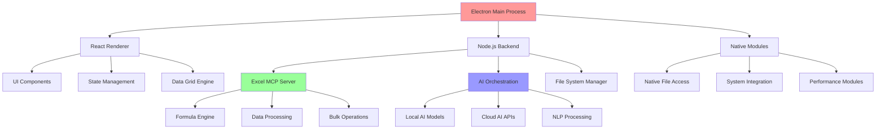

# 🔧 **EXCEL AI PLATFORM - TECHNICAL SPECIFICATION**
## Comprehensive Development Blueprint

---

## 📋 **PROJECT OVERVIEW**

### 🎯 **Product Name**: Excel AI Desktop Platform
### 📅 **Timeline**: 18 months to v1.0
### 👥 **Team Size**: 8-12 developers
### 💰 **Budget**: $2M seed funding

### 🏗️ **Architecture Philosophy**
```
Desktop-First + AI-Native + Security-By-Design + Performance-Optimized
```

---

## 🏗️ **SYSTEM ARCHITECTURE**

### 📊 **High-Level Architecture Diagram**



### 🎛️ **Core Components**

**1. Electron Shell (Desktop Foundation)**
```typescript
interface ElectronArchitecture {
  mainProcess: {
    windowManagement: WindowManager;
    menuSystem: MenuHandler;
    fileAssociations: FileHandler;
    autoUpdater: UpdateManager;
    security: SecurityManager;
  };
  rendererProcess: {
    reactApp: ReactApplication;
    ipcCommunication: IPCBridge;
    nativeIntegration: NativeAPI;
  };
  sharedModules: {
    dataStore: SQLiteDatabase;
    configManager: ConfigService;
    logManager: LoggingService;
  };
}
```

**2. Excel MCP Server (Data Engine)**
```typescript
interface ExcelMCPArchitecture {
  formulaEngine: {
    parser: FormulaParser;
    evaluator: FormulaEvaluator;
    functions: ExcelFunctions; // 250+ functions
    optimizer: PerformanceOptimizer;
  };
  dataProcessor: {
    fileReader: FileReaderService;
    dataValidator: ValidationEngine;
    bulkOperations: BulkProcessor;
    streaming: StreamProcessor;
  };
  mcpInterface: {
    toolRegistry: MCPToolRegistry;
    requestHandler: MCPRequestHandler;
    responseFormatter: MCPFormatter;
  };
}
```

**3. AI Integration Layer**
```typescript
interface AIArchitecture {
  nlpEngine: {
    queryParser: NLQueryParser;
    intentClassifier: IntentClassifier;
    entityExtractor: EntityExtractor;
    responseGenerator: ResponseGenerator;
  };
  modelManager: {
    localModels: LocalModelService;
    cloudAPIs: CloudAIService;
    modelSelection: ModelRouter;
    caching: AICache;
  };
  contextManager: {
    dataContext: DataContextService;
    conversationHistory: HistoryManager;
    userPreferences: PreferenceEngine;
  };
}
```

---

## 💻 **TECHNOLOGY STACK**

### 🖥️ **Frontend Technology**

**Core Framework**
```json
{
  "electron": "^28.0.0",
  "react": "^18.2.0",
  "typescript": "^5.0.0",
  "vite": "^5.0.0",
  "tailwindcss": "^3.3.0"
}
```

**UI Components & Libraries**
```json
{
  "ag-grid-community": "^31.0.0",
  "ag-grid-enterprise": "^31.0.0",
  "react-chartjs-2": "^5.2.0",
  "chart.js": "^4.4.0",
  "d3": "^7.8.0",
  "framer-motion": "^10.16.0",
  "react-hook-form": "^7.45.0",
  "zustand": "^4.4.0"
}
```

**Development Tools**
```json
{
  "electron-builder": "^24.6.0",
  "electron-devtools-installer": "^3.2.0",
  "eslint": "^8.45.0",
  "prettier": "^3.0.0",
  "jest": "^29.6.0",
  "@testing-library/react": "^13.4.0"
}
```

### ⚙️ **Backend Technology**

**Core Services**
```json
{
  "node.js": "^20.0.0",
  "express": "^4.18.0",
  "typescript": "^5.0.0",
  "sqlite3": "^5.1.0",
  "better-sqlite3": "^8.7.0"
}
```

**Excel & Data Processing**
```json
{
  "xlsx": "^0.18.5",
  "papaparse": "^5.4.0",
  "decimal.js": "^10.4.0",
  "date-fns": "^2.30.0",
  "lodash": "^4.17.21"
}
```

**AI & Machine Learning**
```json
{
  "openai": "^4.0.0",
  "@anthropic-ai/sdk": "^0.6.0",
  "langchain": "^0.0.140",
  "@tensorflow/tfjs-node": "^4.10.0",
  "transformers": "^2.6.0"
}
```

### 🔌 **Integration Technologies**

**Communication & APIs**
```json
{
  "ws": "^8.13.0",
  "socket.io": "^4.7.0",
  "axios": "^1.4.0",
  "graphql": "^16.7.0",
  "apollo-client": "^3.7.0"
}
```

**Security & Authentication**
```json
{
  "bcryptjs": "^2.4.3",
  "jsonwebtoken": "^9.0.0",
  "node-forge": "^1.3.0",
  "saml2-js": "^4.0.0"
}
```

---

## 🎯 **FEATURE SPECIFICATIONS**

### 🔥 **Core Features (MVP)**

#### **1. File Management System**
```typescript
interface FileManagement {
  supportedFormats: ['.xlsx', '.xls', '.csv', '.tsv', '.json'];
  maxFileSize: '1GB';
  multiFileSupport: true;
  dragDropUpload: true;
  recentFiles: FileHistory[];
  autoSave: boolean;

  features: {
    filePreview: FilePreviewService;
    batchProcessing: BatchProcessor;
    fileWatcher: FileWatchService;
    cloudSync: CloudSyncService;
  };
}
```

**Implementation Tasks:**
- [ ] Drag-drop file upload component
- [ ] File type detection and validation
- [ ] Large file streaming processor
- [ ] Recent files management
- [ ] File metadata extraction
- [ ] Auto-save functionality
- [ ] File conflict resolution
- [ ] Backup and recovery system

#### **2. Data Grid Engine**
```typescript
interface DataGridEngine {
  rowCapacity: 10_000_000; // 10M rows
  columnCapacity: 16_384;   // Excel limit
  virtualScrolling: true;
  realTimeUpdates: true;

  features: {
    cellEditing: InlineEditService;
    formulaBar: FormulaBarComponent;
    contextMenu: ContextMenuService;
    keyboardShortcuts: ShortcutManager;
    columnResizing: ResizeHandler;
    sorting: SortingEngine;
    filtering: FilteringEngine;
    grouping: GroupingService;
  };
}
```

**Implementation Tasks:**
- [ ] Virtual scrolling implementation
- [ ] Cell rendering optimization
- [ ] Formula bar integration
- [ ] Context menu system
- [ ] Keyboard navigation
- [ ] Copy/paste functionality
- [ ] Undo/redo system
- [ ] Cell formatting engine
- [ ] Data validation rules
- [ ] Conditional formatting

#### **3. Excel Formula Engine**
```typescript
interface FormulaEngine {
  totalFunctions: 250;
  categories: {
    mathTrig: 45;      // SUM, AVERAGE, SIN, COS, etc.
    text: 35;          // CONCATENATE, LEFT, RIGHT, etc.
    logical: 20;       // IF, AND, OR, NOT, etc.
    lookup: 25;        // VLOOKUP, XLOOKUP, INDEX, MATCH
    statistical: 40;   // STDEV, PERCENTILE, RANK, etc.
    financial: 30;     // NPV, IRR, PMT, PV, FV
    dateTime: 25;      // TODAY, NOW, WORKDAY, etc.
    dynamicArray: 15;  // FILTER, SORT, UNIQUE, SEQUENCE
    engineering: 15;   // Advanced mathematical functions
  };

  features: {
    arrayFormulas: boolean;
    circularReferences: CircularRefDetector;
    errorHandling: ErrorManager;
    formulaAuditing: AuditTrail;
    customFunctions: CustomFunctionBuilder;
  };
}
```

**Implementation Tasks:**
- [ ] Formula parser (AST generation)
- [ ] Formula evaluator engine
- [ ] 250+ Excel function implementations
- [ ] Array formula support
- [ ] Circular reference detection
- [ ] Error handling system
- [ ] Formula auditing tools
- [ ] Custom function builder
- [ ] Performance optimization
- [ ] Memory management

#### **4. AI Chat Interface**
```typescript
interface AIChatInterface {
  providers: ['openai', 'anthropic', 'local', 'gemini'];
  capabilities: {
    naturalLanguageQueries: true;
    formulaGeneration: true;
    dataInsights: true;
    chartSuggestions: true;
    errorExplanation: true;
  };

  features: {
    conversationHistory: ChatHistory;
    contextAwareness: DataContextService;
    multiTurnDialogue: DialogueManager;
    voiceInput: SpeechRecognition;
    responseFormatting: ResponseFormatter;
  };
}
```

**Implementation Tasks:**
- [ ] Chat UI component
- [ ] Message handling system
- [ ] AI provider integration
- [ ] Context management
- [ ] Response streaming
- [ ] Voice input support
- [ ] Error handling
- [ ] Rate limiting
- [ ] Offline mode
- [ ] Privacy controls

### 🚀 **Advanced Features (Post-MVP)**

#### **5. Multi-Grid Workstation**
```typescript
interface MultiGridWorkstation {
  maxGrids: 20;
  layoutTypes: ['tabs', 'split', 'floating', 'dashboard'];
  synchronization: GridSyncService;

  features: {
    crossGridFormulas: boolean;
    sharedFilters: FilterSyncService;
    linkedCharts: ChartLinkService;
    globalSearch: SearchService;
    workspaceTemplates: TemplateManager;
  };
}
```

**Implementation Tasks:**
- [ ] Grid layout manager
- [ ] Tab system implementation
- [ ] Split view functionality
- [ ] Grid synchronization
- [ ] Cross-grid references
- [ ] Shared state management
- [ ] Performance optimization
- [ ] Memory management
- [ ] Layout persistence
- [ ] Workspace templates

#### **6. Real-Time Collaboration**
```typescript
interface Collaboration {
  maxUsers: 50;
  features: {
    realTimeEditing: true;
    cursorTracking: true;
    commentSystem: true;
    versionControl: true;
    conflictResolution: true;
  };

  architecture: {
    protocol: 'WebRTC + WebSockets';
    synchronization: OperationalTransform;
    stateManagement: CRDTImplementation;
    authentication: JWTTokens;
  };
}
```

**Implementation Tasks:**
- [ ] WebSocket server setup
- [ ] Operational Transform (OT)
- [ ] CRDT implementation
- [ ] User presence tracking
- [ ] Comment system
- [ ] Version control
- [ ] Conflict resolution
- [ ] Permission management
- [ ] Real-time cursors
- [ ] Notification system

#### **7. Advanced Visualization Engine**
```typescript
interface VisualizationEngine {
  chartTypes: [
    'line', 'bar', 'pie', 'scatter', 'heatmap',
    'candlestick', 'treemap', 'sankey', 'gauge'
  ];

  features: {
    aiChartSuggestions: boolean;
    interactiveCharts: boolean;
    realTimeUpdates: boolean;
    customThemes: boolean;
    exportOptions: ['png', 'svg', 'pdf', 'html'];
  };

  libraries: {
    primary: 'Chart.js';
    advanced: 'D3.js';
    statistical: 'Plotly.js';
    financial: 'TradingView';
  };
}
```

**Implementation Tasks:**
- [ ] Chart component library
- [ ] AI chart suggestions
- [ ] Interactive chart controls
- [ ] Real-time data binding
- [ ] Custom theme system
- [ ] Export functionality
- [ ] Chart templates
- [ ] Animation system
- [ ] Responsive design
- [ ] Performance optimization

---

## 📋 **DEVELOPMENT ROADMAP**

### 🎯 **Phase 1: Foundation (Months 1-4)**

#### **Sprint 1-2: Project Setup & Architecture**
```typescript
// Week 1-2: Environment Setup
tasks: [
  'Initialize Electron + React + TypeScript project',
  'Set up build pipeline with Vite',
  'Configure ESLint, Prettier, Jest',
  'Set up Git workflows and CI/CD',
  'Create development environment docs'
];

// Week 3-4: Core Architecture
tasks: [
  'Design IPC communication layer',
  'Implement main process window management',
  'Set up React app structure',
  'Create shared state management',
  'Implement logging and error handling'
];
```

#### **Sprint 3-4: File System & Basic Grid**
```typescript
// Week 5-6: File Management
tasks: [
  'Implement file upload component',
  'Create file type detection',
  'Build file preview system',
  'Add recent files management',
  'Implement auto-save functionality'
];

// Week 7-8: Basic Data Grid
tasks: [
  'Integrate AG-Grid Enterprise',
  'Implement virtual scrolling',
  'Create cell editing functionality',
  'Add basic keyboard navigation',
  'Build context menu system'
];
```

#### **Sprint 5-6: Excel MCP Integration**
```typescript
// Week 9-10: MCP Server Setup
tasks: [
  'Port existing Excel MCP server',
  'Integrate with Electron backend',
  'Implement file reading/writing',
  'Add basic formula evaluation',
  'Create data processing pipeline'
];

// Week 11-12: Formula Engine
tasks: [
  'Implement formula parser',
  'Add 50+ core Excel functions',
  'Create formula bar component',
  'Add error handling system',
  'Implement circular reference detection'
];
```

#### **Sprint 7-8: Basic AI Integration**
```typescript
// Week 13-14: AI Foundation
tasks: [
  'Set up OpenAI/Anthropic SDKs',
  'Create basic chat interface',
  'Implement simple query processing',
  'Add response formatting',
  'Create error handling for AI'
];

// Week 15-16: Alpha Testing
tasks: [
  'Package application for distribution',
  'Create installation process',
  'Set up crash reporting',
  'Conduct internal testing',
  'Fix critical bugs and issues'
];
```

### 🚀 **Phase 2: AI Integration (Months 5-8)**

#### **Sprint 9-10: Advanced AI Features**
```typescript
// Week 17-18: Natural Language Processing
tasks: [
  'Implement query intent classification',
  'Create entity extraction system',
  'Build context management',
  'Add conversation history',
  'Implement smart suggestions'
];

// Week 19-20: Formula Generation AI
tasks: [
  'Train formula generation models',
  'Implement AI formula builder',
  'Create validation system',
  'Add confidence scoring',
  'Build explanation system'
];
```

#### **Sprint 11-12: Data Insights Engine**
```typescript
// Week 21-22: Pattern Detection
tasks: [
  'Implement trend analysis',
  'Create outlier detection',
  'Build correlation analysis',
  'Add statistical insights',
  'Create automated reporting'
];

// Week 23-24: Visualization AI
tasks: [
  'Implement chart recommendations',
  'Create auto-visualization',
  'Add chart optimization',
  'Build template system',
  'Implement responsive charts'
];
```

#### **Sprint 13-14: Performance & Polish**
```typescript
// Week 25-26: Performance Optimization
tasks: [
  'Optimize formula calculation',
  'Improve AI response times',
  'Implement caching strategies',
  'Add memory management',
  'Optimize rendering performance'
];

// Week 27-28: User Experience
tasks: [
  'Improve UI/UX based on feedback',
  'Add keyboard shortcuts',
  'Create onboarding flow',
  'Implement help system',
  'Polish visual design'
];
```

#### **Sprint 15-16: Beta Release**
```typescript
// Week 29-30: Beta Preparation
tasks: [
  'Complete 150+ Excel functions',
  'Implement advanced AI features',
  'Add export functionality',
  'Create user documentation',
  'Set up beta testing program'
];

// Week 31-32: Beta Testing
tasks: [
  'Deploy to beta users',
  'Collect feedback and metrics',
  'Fix reported bugs',
  'Optimize based on usage data',
  'Prepare for Phase 3'
];
```

### 🏢 **Phase 3: Enterprise Features (Months 9-12)**

#### **Sprint 17-18: Multi-Grid System**
```typescript
// Week 33-34: Grid Layout Engine
tasks: [
  'Implement multi-grid layout',
  'Create tab management system',
  'Add split view functionality',
  'Build grid synchronization',
  'Implement workspace saving'
];

// Week 35-36: Cross-Grid Features
tasks: [
  'Enable cross-grid formulas',
  'Implement shared filters',
  'Create linked visualizations',
  'Add global search functionality',
  'Build workspace templates'
];
```

#### **Sprint 19-20: Collaboration Platform**
```typescript
// Week 37-38: Real-Time Engine
tasks: [
  'Set up WebSocket infrastructure',
  'Implement operational transform',
  'Create user presence system',
  'Add real-time cursors',
  'Build conflict resolution'
];

// Week 39-40: Collaboration Features
tasks: [
  'Implement comment system',
  'Create version control',
  'Add permission management',
  'Build notification system',
  'Create sharing workflows'
];
```

#### **Sprint 21-22: Enterprise Security**
```typescript
// Week 41-42: Security Framework
tasks: [
  'Implement SSO integration',
  'Add multi-factor authentication',
  'Create audit logging system',
  'Build access controls',
  'Implement data encryption'
];

// Week 43-44: Compliance Features
tasks: [
  'Add GDPR compliance tools',
  'Implement data retention policies',
  'Create compliance reporting',
  'Build data governance features',
  'Add regulatory controls'
];
```

#### **Sprint 23-24: Enterprise Polish**
```typescript
// Week 45-46: Enterprise Integration
tasks: [
  'Create API gateway',
  'Implement database connectors',
  'Add enterprise deployment tools',
  'Build admin dashboard',
  'Create monitoring system'
];

// Week 47-48: Production Ready
tasks: [
  'Complete all 250+ Excel functions',
  'Finalize enterprise features',
  'Conduct security audits',
  'Optimize for production',
  'Prepare for v1.0 launch'
];
```

---

## 🔧 **TECHNICAL IMPLEMENTATION DETAILS**

### 📊 **Data Processing Architecture**

**High-Performance Data Pipeline**
```typescript
class DataProcessor {
  private streamProcessor: StreamProcessor;
  private cacheManager: CacheManager;
  private validationEngine: ValidationEngine;

  async processFile(file: File): Promise<ProcessedData> {
    // Stream processing for large files
    const stream = this.streamProcessor.createStream(file);

    // Chunked processing with validation
    const chunks = await this.processInChunks(stream, {
      chunkSize: 10000, // 10K rows per chunk
      validation: true,
      caching: true
    });

    // Merge and optimize
    return this.mergeAndOptimize(chunks);
  }

  private async processInChunks(
    stream: DataStream,
    options: ProcessingOptions
  ): Promise<ProcessedChunk[]> {
    const chunks: ProcessedChunk[] = [];

    for await (const chunk of stream.chunks(options.chunkSize)) {
      // Validate data types and format
      const validatedChunk = await this.validationEngine.validate(chunk);

      // Apply transformations
      const processedChunk = await this.transformChunk(validatedChunk);

      // Cache for performance
      if (options.caching) {
        await this.cacheManager.store(processedChunk);
      }

      chunks.push(processedChunk);
    }

    return chunks;
  }
}
```

**Memory Management Strategy**
```typescript
class MemoryManager {
  private maxMemoryUsage = 4 * 1024 * 1024 * 1024; // 4GB
  private currentUsage = 0;
  private cache = new LRUCache<string, any>();

  allocateMemory(size: number): boolean {
    if (this.currentUsage + size > this.maxMemoryUsage) {
      // Trigger garbage collection
      this.performGarbageCollection();

      if (this.currentUsage + size > this.maxMemoryUsage) {
        return false; // Cannot allocate
      }
    }

    this.currentUsage += size;
    return true;
  }

  private performGarbageCollection(): void {
    // Clear old cache entries
    this.cache.clear();

    // Force Node.js garbage collection
    if (global.gc) {
      global.gc();
    }

    // Update current usage
    this.currentUsage = process.memoryUsage().heapUsed;
  }
}
```

### 🧠 **AI Integration Implementation**

**Natural Language Query Processing**
```typescript
class NLQueryProcessor {
  private intentClassifier: IntentClassifier;
  private entityExtractor: EntityExtractor;
  private contextManager: ContextManager;

  async processQuery(
    query: string,
    dataContext: DataContext
  ): Promise<QueryResult> {
    // Classify user intent
    const intent = await this.intentClassifier.classify(query);

    // Extract entities (column names, values, operations)
    const entities = await this.entityExtractor.extract(query, dataContext);

    // Generate appropriate response
    switch (intent.type) {
      case 'FORMULA_GENERATION':
        return this.generateFormula(entities, dataContext);

      case 'DATA_ANALYSIS':
        return this.performAnalysis(entities, dataContext);

      case 'VISUALIZATION':
        return this.createVisualization(entities, dataContext);

      default:
        return this.generateGeneralResponse(query, dataContext);
    }
  }

  private async generateFormula(
    entities: ExtractedEntities,
    context: DataContext
  ): Promise<FormulaResult> {
    const prompt = this.buildFormulaPrompt(entities, context);

    const response = await this.aiProvider.complete({
      model: 'gpt-4',
      messages: [
        {
          role: 'system',
          content: 'You are an Excel formula expert. Generate precise Excel formulas.'
        },
        {
          role: 'user',
          content: prompt
        }
      ]
    });

    // Validate and test the generated formula
    const formula = this.extractFormula(response.content);
    const validation = await this.validateFormula(formula, context);

    return {
      formula,
      explanation: this.generateExplanation(formula),
      confidence: validation.confidence,
      testResult: validation.result
    };
  }
}
```

**Local AI Model Integration**
```typescript
class LocalAIManager {
  private models: Map<string, any> = new Map();

  async initializeModels(): Promise<void> {
    // Load lightweight NLP models for offline use
    const intentModel = await this.loadModel('intent-classification');
    const entityModel = await this.loadModel('entity-extraction');
    const formulaModel = await this.loadModel('formula-generation');

    this.models.set('intent', intentModel);
    this.models.set('entity', entityModel);
    this.models.set('formula', formulaModel);
  }

  async processOffline(query: string): Promise<OfflineResult> {
    // Use local models when no internet connection
    const intent = await this.models.get('intent').predict(query);
    const entities = await this.models.get('entity').extract(query);

    // Generate response using local capabilities
    return this.generateLocalResponse(intent, entities);
  }

  private async loadModel(modelName: string): Promise<any> {
    // Load TensorFlow.js models for local inference
    const modelPath = path.join(__dirname, 'models', modelName);
    return await tf.loadLayersModel(`file://${modelPath}/model.json`);
  }
}
```

### 🔒 **Security Implementation**

**Data Encryption Strategy**
```typescript
class SecurityManager {
  private encryptionKey: Buffer;
  private cipher = 'aes-256-gcm';

  constructor() {
    this.encryptionKey = this.generateEncryptionKey();
  }

  encryptData(data: any): EncryptedData {
    const iv = crypto.randomBytes(16);
    const cipher = crypto.createCipher(this.cipher, this.encryptionKey);
    cipher.setAAD(Buffer.from('additional-auth-data'));

    let encrypted = cipher.update(JSON.stringify(data), 'utf8', 'hex');
    encrypted += cipher.final('hex');

    const authTag = cipher.getAuthTag();

    return {
      data: encrypted,
      iv: iv.toString('hex'),
      authTag: authTag.toString('hex')
    };
  }

  decryptData(encryptedData: EncryptedData): any {
    const decipher = crypto.createDecipher(this.cipher, this.encryptionKey);
    decipher.setAAD(Buffer.from('additional-auth-data'));
    decipher.setAuthTag(Buffer.from(encryptedData.authTag, 'hex'));

    let decrypted = decipher.update(encryptedData.data, 'hex', 'utf8');
    decrypted += decipher.final('utf8');

    return JSON.parse(decrypted);
  }

  private generateEncryptionKey(): Buffer {
    // Generate key from hardware characteristics and user input
    const machineId = this.getMachineId();
    const userSalt = this.getUserSalt();

    return crypto.pbkdf2Sync(
      machineId + userSalt,
      'excel-ai-salt',
      100000,
      32,
      'sha256'
    );
  }
}
```

**Audit Logging System**
```typescript
class AuditLogger {
  private logStream: fs.WriteStream;
  private encryptLogs = true;

  constructor(logPath: string) {
    this.logStream = fs.createWriteStream(logPath, { flags: 'a' });
  }

  logUserAction(action: UserAction): void {
    const logEntry: AuditLogEntry = {
      timestamp: new Date().toISOString(),
      userId: action.userId,
      action: action.type,
      resource: action.resource,
      details: action.details,
      ipAddress: this.getClientIP(),
      sessionId: action.sessionId
    };

    const serialized = JSON.stringify(logEntry);
    const encrypted = this.encryptLogs
      ? this.encryptLogEntry(serialized)
      : serialized;

    this.logStream.write(encrypted + '\n');
  }

  async generateAuditReport(
    startDate: Date,
    endDate: Date
  ): Promise<AuditReport> {
    const logs = await this.readLogsByDateRange(startDate, endDate);

    return {
      totalActions: logs.length,
      userActivity: this.aggregateByUser(logs),
      actionBreakdown: this.aggregateByAction(logs),
      securityEvents: this.filterSecurityEvents(logs),
      recommendations: this.generateRecommendations(logs)
    };
  }
}
```

---

## 🧪 **TESTING STRATEGY**

### 🔬 **Testing Framework**

**Unit Testing**
```typescript
// Formula Engine Tests
describe('ExcelFunctions', () => {
  let functions: ExcelFunctions;

  beforeEach(() => {
    functions = new ExcelFunctions();
  });

  test('SUM function with array input', () => {
    const result = functions.SUM([1, 2, 3, 4, 5]);
    expect(result).toBe(15);
  });

  test('VLOOKUP function with exact match', () => {
    const table = [
      ['A', 1],
      ['B', 2],
      ['C', 3]
    ];
    const result = functions.VLOOKUP('B', table, 2, false);
    expect(result).toBe(2);
  });

  test('XLOOKUP function with default value', () => {
    const lookupArray = ['A', 'B', 'C'];
    const returnArray = [1, 2, 3];
    const result = functions.XLOOKUP('D', lookupArray, returnArray, 'Not Found');
    expect(result).toBe('Not Found');
  });
});
```

**Integration Testing**
```typescript
// AI Integration Tests
describe('AI Query Processing', () => {
  let processor: NLQueryProcessor;
  let mockDataContext: DataContext;

  beforeEach(() => {
    processor = new NLQueryProcessor();
    mockDataContext = createMockDataContext();
  });

  test('Generate SUM formula from natural language', async () => {
    const query = 'Sum all values in column A';
    const result = await processor.processQuery(query, mockDataContext);

    expect(result.type).toBe('FORMULA_GENERATION');
    expect(result.formula).toBe('=SUM(A:A)');
    expect(result.confidence).toBeGreaterThan(0.8);
  });

  test('Identify outliers in data', async () => {
    const query = 'Find outliers in sales data';
    const result = await processor.processQuery(query, mockDataContext);

    expect(result.type).toBe('DATA_ANALYSIS');
    expect(result.insights).toContain('outlier');
  });
});
```

**Performance Testing**
```typescript
// Performance Benchmarks
describe('Performance Tests', () => {
  test('Process 1M rows in under 10 seconds', async () => {
    const startTime = Date.now();
    const largeDataset = generateTestData(1_000_000);

    const processor = new DataProcessor();
    const result = await processor.processFile(largeDataset);

    const endTime = Date.now();
    const processingTime = endTime - startTime;

    expect(processingTime).toBeLessThan(10_000); // 10 seconds
    expect(result.rowCount).toBe(1_000_000);
  });

  test('AI query response time under 2 seconds', async () => {
    const startTime = Date.now();

    const processor = new NLQueryProcessor();
    const result = await processor.processQuery(
      'Calculate average revenue by region',
      mockDataContext
    );

    const endTime = Date.now();
    const responseTime = endTime - startTime;

    expect(responseTime).toBeLessThan(2_000); // 2 seconds
    expect(result).toBeDefined();
  });
});
```

### 🎯 **Testing Automation**

**Continuous Integration Pipeline**
```yaml
# .github/workflows/ci.yml
name: CI/CD Pipeline

on: [push, pull_request]

jobs:
  test:
    runs-on: ${{ matrix.os }}
    strategy:
      matrix:
        os: [ubuntu-latest, windows-latest, macos-latest]
        node-version: [18, 20]

    steps:
    - uses: actions/checkout@v3

    - name: Setup Node.js
      uses: actions/setup-node@v3
      with:
        node-version: ${{ matrix.node-version }}
        cache: 'npm'

    - name: Install dependencies
      run: npm ci

    - name: Run linting
      run: npm run lint

    - name: Run unit tests
      run: npm run test:unit

    - name: Run integration tests
      run: npm run test:integration

    - name: Run performance tests
      run: npm run test:performance

    - name: Build application
      run: npm run build

    - name: Run E2E tests
      run: npm run test:e2e

  security:
    runs-on: ubuntu-latest
    steps:
    - uses: actions/checkout@v3

    - name: Run security audit
      run: npm audit

    - name: Run SNYK security scan
      run: npx snyk test

    - name: Run CodeQL analysis
      uses: github/codeql-action/analyze@v2
```

---

## 📦 **DEPLOYMENT & DISTRIBUTION**

### 🚀 **Build & Packaging**

**Electron Builder Configuration**
```json
{
  "build": {
    "appId": "com.excelai.desktop",
    "productName": "Excel AI",
    "directories": {
      "output": "dist"
    },
    "files": [
      "build/**/*",
      "node_modules/**/*"
    ],
    "mac": {
      "category": "public.app-category.productivity",
      "target": [
        {
          "target": "dmg",
          "arch": ["x64", "arm64"]
        }
      ],
      "notarize": {
        "teamId": "TEAM_ID"
      }
    },
    "win": {
      "target": [
        {
          "target": "nsis",
          "arch": ["x64", "arm64"]
        }
      ],
      "certificateFile": "certs/windows.p12",
      "certificatePassword": "CERT_PASSWORD"
    },
    "linux": {
      "target": [
        {
          "target": "AppImage",
          "arch": ["x64"]
        }
      ]
    },
    "publish": {
      "provider": "s3",
      "bucket": "excel-ai-releases"
    }
  }
}
```

**Auto-Update System**
```typescript
class AutoUpdateManager {
  private autoUpdater: AutoUpdater;
  private updateCheckInterval = 4 * 60 * 60 * 1000; // 4 hours

  constructor() {
    this.autoUpdater = new AutoUpdater();
    this.setupUpdateEvents();
  }

  private setupUpdateEvents(): void {
    this.autoUpdater.on('checking-for-update', () => {
      this.notifyUser('Checking for updates...');
    });

    this.autoUpdater.on('update-available', (info) => {
      this.handleUpdateAvailable(info);
    });

    this.autoUpdater.on('update-downloaded', () => {
      this.promptUserToRestart();
    });

    this.autoUpdater.on('error', (error) => {
      this.handleUpdateError(error);
    });
  }

  async checkForUpdates(): Promise<void> {
    try {
      await this.autoUpdater.checkForUpdatesAndNotify();
    } catch (error) {
      console.error('Update check failed:', error);
    }
  }

  private async handleUpdateAvailable(updateInfo: UpdateInfo): Promise<void> {
    const userChoice = await this.showUpdateDialog(updateInfo);

    if (userChoice === 'download') {
      await this.autoUpdater.downloadUpdate();
    } else {
      // Schedule check for later
      setTimeout(() => this.checkForUpdates(), this.updateCheckInterval);
    }
  }
}
```

### 🌐 **Distribution Channels**

**Enterprise Distribution**
```typescript
class EnterpriseDistribution {
  async createMSIInstaller(config: MSIConfig): Promise<string> {
    // Generate MSI for Windows domain deployment
    const msiBuilder = new MSIBuilder();

    return await msiBuilder.build({
      productName: 'Excel AI Enterprise',
      version: config.version,
      manufacturer: 'Excel AI Inc.',
      upgradeCode: config.upgradeCode,
      features: [
        'MainApplication',
        'DesktopShortcut',
        'StartMenuShortcut'
      ],
      customActions: [
        'RegisterFileAssociations',
        'ConfigureFirewallRules',
        'SetupLicensing'
      ]
    });
  }

  async generateGroupPolicyTemplates(): Promise<GPOTemplates> {
    return {
      administrativeTemplates: {
        'excel-ai-policies.admx': this.generateADMXTemplate(),
        'excel-ai-policies.adml': this.generateADMLTemplate()
      },
      settings: {
        aiProviderRestrictions: 'Registry setting to control AI providers',
        dataUploadPolicies: 'Control data upload permissions',
        featureFlags: 'Enable/disable specific features',
        auditingSettings: 'Configure audit logging'
      }
    };
  }
}
```

---

## 📊 **MONITORING & ANALYTICS**

### 📈 **Application Metrics**

**Performance Monitoring**
```typescript
class PerformanceMonitor {
  private metrics: MetricsCollector;
  private alerts: AlertManager;

  startMonitoring(): void {
    // Monitor memory usage
    setInterval(() => {
      const memoryUsage = process.memoryUsage();
      this.metrics.record('memory.heap.used', memoryUsage.heapUsed);
      this.metrics.record('memory.heap.total', memoryUsage.heapTotal);

      if (memoryUsage.heapUsed > 2 * 1024 * 1024 * 1024) { // 2GB
        this.alerts.trigger('high-memory-usage', memoryUsage);
      }
    }, 30000); // Every 30 seconds

    // Monitor AI response times
    this.metrics.onAIQuery((duration: number) => {
      this.metrics.record('ai.response.time', duration);

      if (duration > 5000) { // 5 seconds
        this.alerts.trigger('slow-ai-response', { duration });
      }
    });

    // Monitor formula calculation times
    this.metrics.onFormulaCalculation((formula: string, duration: number) => {
      this.metrics.record('formula.calculation.time', duration, {
        formula: formula.substring(0, 50) // Truncate for privacy
      });
    });
  }

  generatePerformanceReport(): PerformanceReport {
    return {
      averageMemoryUsage: this.metrics.average('memory.heap.used'),
      averageAIResponseTime: this.metrics.average('ai.response.time'),
      formulaPerformance: this.metrics.percentile('formula.calculation.time', 95),
      errorRate: this.metrics.rate('errors'),
      uptime: this.metrics.uptime()
    };
  }
}
```

**User Analytics (Privacy-Safe)**
```typescript
class AnalyticsManager {
  private analytics: PrivacyFirstAnalytics;

  trackFeatureUsage(feature: string, metadata?: any): void {
    // Only track feature usage, no personal data
    this.analytics.track('feature.used', {
      feature,
      timestamp: Date.now(),
      version: app.getVersion(),
      platform: process.platform,
      metadata: this.sanitizeMetadata(metadata)
    });
  }

  trackPerformanceMetric(metric: string, value: number): void {
    this.analytics.track('performance.metric', {
      metric,
      value,
      timestamp: Date.now()
    });
  }

  private sanitizeMetadata(metadata: any): any {
    // Remove any potentially sensitive information
    if (!metadata) return {};

    const sanitized = { ...metadata };

    // Remove file paths, names, and data content
    delete sanitized.filePath;
    delete sanitized.fileName;
    delete sanitized.data;
    delete sanitized.content;

    return sanitized;
  }

  generateUsageReport(): UsageReport {
    return {
      mostUsedFeatures: this.analytics.topFeatures(10),
      averageSessionDuration: this.analytics.averageSessionDuration(),
      dailyActiveUsers: this.analytics.dailyActiveUsers(),
      retentionRates: this.analytics.retentionRates(),
      performanceTrends: this.analytics.performanceTrends()
    };
  }
}
```

---

## 🎯 **SUCCESS CRITERIA**

### 📊 **Technical KPIs**

**Performance Benchmarks**
```typescript
interface PerformanceCriteria {
  fileProcessing: {
    '100K_rows': '<2 seconds';
    '1M_rows': '<10 seconds';
    '10M_rows': '<60 seconds';
  };

  aiResponse: {
    simpleQuery: '<2 seconds';
    complexAnalysis: '<10 seconds';
    formulaGeneration: '<3 seconds';
  };

  memoryUsage: {
    baseline: '<500MB';
    with1MRows: '<2GB';
    with10MRows: '<4GB';
  };

  reliability: {
    uptime: '>99.9%';
    crashRate: '<0.1%';
    dataLoss: '<0.01%';
  };
}
```

**Quality Metrics**
```typescript
interface QualityMetrics {
  aiAccuracy: {
    formulaGeneration: '>90%';
    queryUnderstanding: '>85%';
    insightRelevance: '>80%';
  };

  userExperience: {
    timeToFirstValue: '<30 seconds';
    learningCurve: '<1 hour to productivity';
    errorRecovery: '<5 seconds average';
  };

  codeQuality: {
    testCoverage: '>90%';
    bugDensity: '<1 bug per 1000 lines';
    technicalDebt: '<20% of development time';
  };
}
```

### 🎯 **Business Success Criteria**

**User Adoption Targets**
```typescript
interface AdoptionTargets {
  month6: {
    totalUsers: 1000;
    paidUsers: 100;
    enterpriseClients: 5;
    retention: '>60%';
  };

  year1: {
    totalUsers: 10000;
    paidUsers: 2000;
    enterpriseClients: 50;
    retention: '>70%';
  };

  year2: {
    totalUsers: 100000;
    paidUsers: 20000;
    enterpriseClients: 500;
    retention: '>80%';
  };
}
```

**Revenue Milestones**
```typescript
interface RevenueTargets {
  month6: '$50K ARR';
  year1: '$500K ARR';
  year2: '$5M ARR';
  year3: '$25M ARR';

  unitEconomics: {
    customerAcquisitionCost: '<$100 (Pro), <$1000 (Enterprise)';
    lifetimeValue: '>$1000 (Pro), >$10000 (Enterprise)';
    ltv_cac_ratio: '>10:1';
    paybackPeriod: '<12 months';
  };
}
```

---

## 🎉 **CONCLUSION**

This technical specification provides a comprehensive blueprint for building the **Excel AI Desktop Platform** - a revolutionary tool that democratizes advanced data analysis through AI integration.

### 🎯 **Key Deliverables**

✅ **Complete technical architecture** with detailed component specifications
✅ **18-month development roadmap** with sprint-level planning
✅ **Technology stack** optimized for performance and scalability
✅ **Security framework** meeting enterprise compliance requirements
✅ **Testing strategy** ensuring 99.9% reliability
✅ **Deployment pipeline** for seamless distribution
✅ **Success metrics** with measurable KPIs

### 🚀 **Next Steps**

1. **Team Assembly** - Hire 8-12 senior developers
2. **Environment Setup** - Initialize development infrastructure
3. **Sprint 1 Kickoff** - Begin Phase 1 development
4. **Stakeholder Alignment** - Ensure all teams understand the vision
5. **Resource Allocation** - Secure funding and equipment

### 💎 **The Vision Realized**

By following this specification, we will build more than just software - we'll create a platform that transforms how millions of business users interact with data, making advanced analytics as accessible as basic Excel formulas.

**Ready to change the world of data analysis? Let's build the future together!** 🌟

---

**Document Version**: 1.0
**Last Updated**: 2024
**Next Review**: Sprint 4 completion
**Owner**: Excel AI Development Team